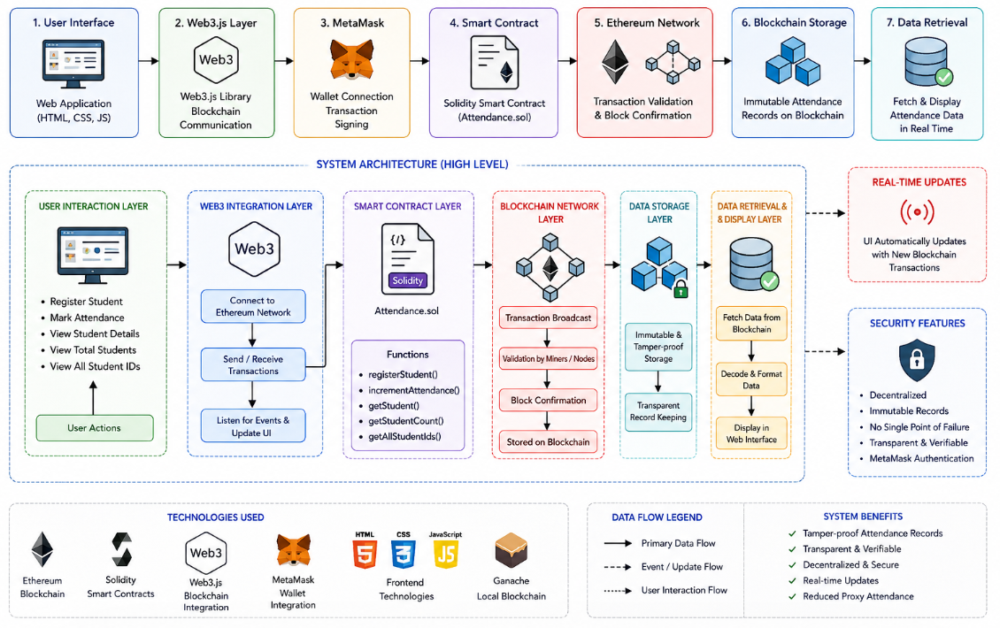
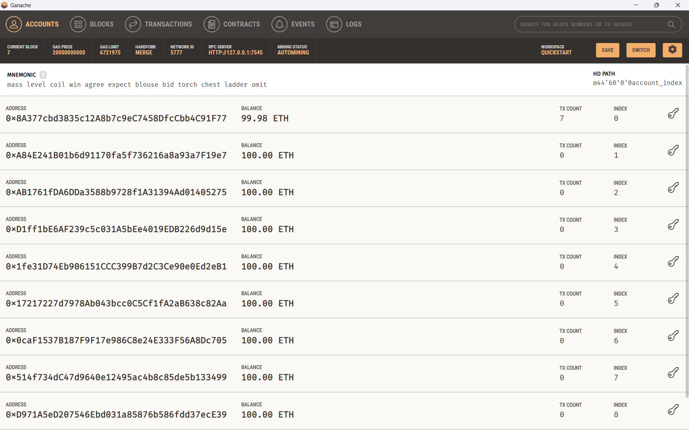
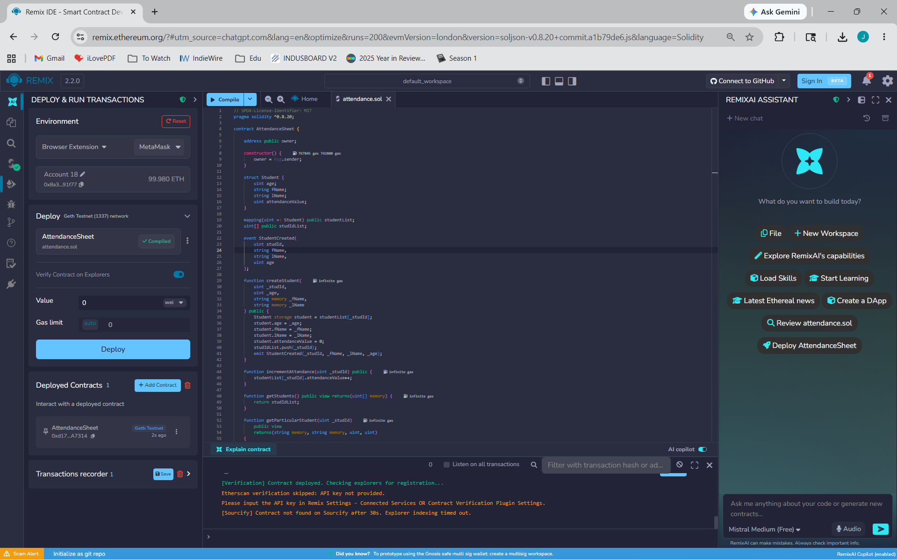
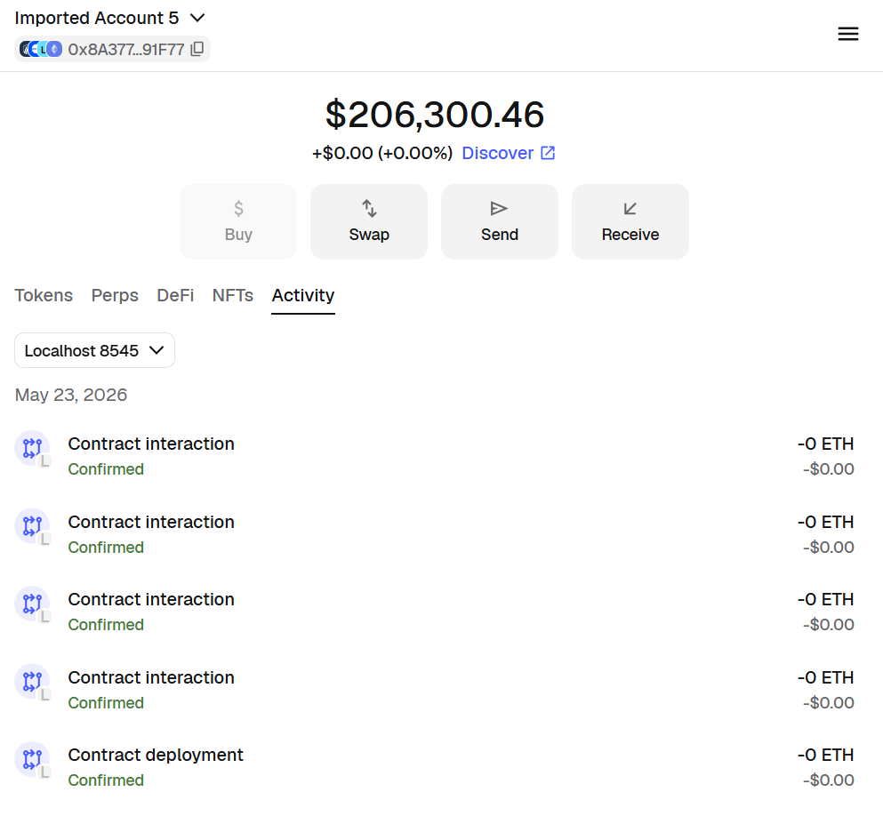
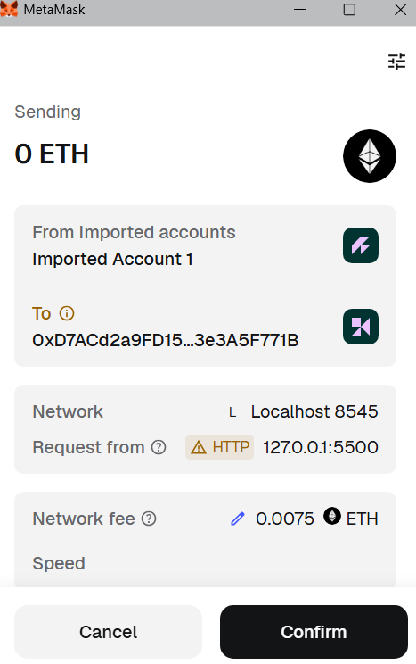
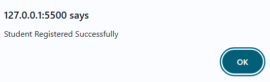
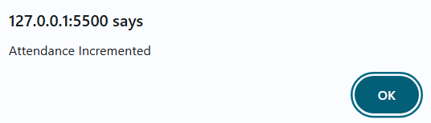
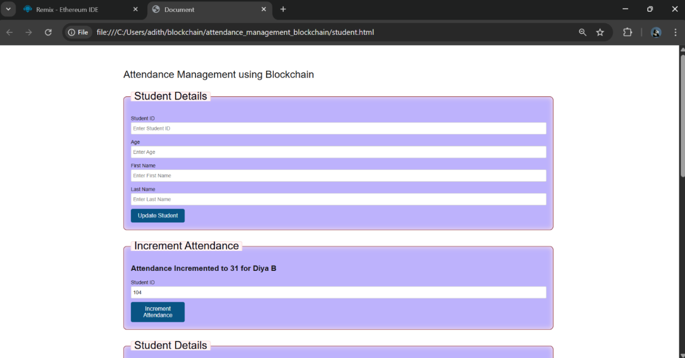
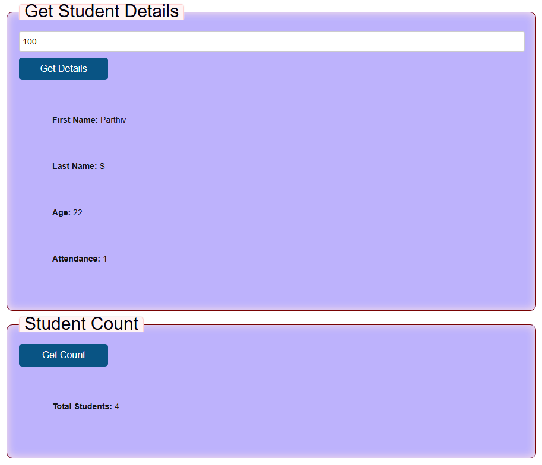

# Blockchain-Based Attendance System


> ### Blockchain Project — VIT Chennai, November 2025  
> Adithya Ajikumar • Joseph Alex Valluvassery • S Saran

---

# The Problem

Traditional attendance management systems used in schools, colleges, and organizations are generally centralized and vulnerable to manipulation, unauthorized access, and data loss. Manual registers and conventional database-driven systems often lack transparency and can be altered without traceable evidence.

These systems also suffer from:

- Proxy attendance
- Human errors
- Single point of failure
- Lack of transparency
- Difficulty in verifying authenticity of records

As institutions grow larger and more digital, maintaining secure and tamper-proof attendance records becomes increasingly important.

This project addresses a different question than conventional attendance systems:

> Not *“Was attendance recorded?”*  
> But *“Can attendance records be permanently trusted and verified?”*

---

# What This Project Does

This project is a blockchain-powered attendance management system that:

1. Registers students securely using Ethereum smart contracts  
2. Stores attendance records permanently on the blockchain  
3. Prevents unauthorized modification of attendance data  
4. Enables transparent and tamper-proof attendance tracking  
5. Allows attendance incrementing through blockchain transactions  
6. Retrieves student details and attendance records in real time  
7. Displays total student count and registered student IDs  
8. Integrates MetaMask and Web3.js for secure blockchain interaction  
9. Provides a simple web interface for attendance management  
10. Eliminates dependency on centralized attendance databases  
11. Ensures immutable and verifiable academic records  
12. Creates a decentralized and secure attendance ecosystem

---

# How It Works

```text
User Interaction (Web Interface)
                ↓
Web3.js Blockchain Communication
                ↓
Smart Contract Execution (Solidity)
                ↓
Ethereum Blockchain Validation
                ↓
Attendance Record Storage
                ↓
Real-Time Data Retrieval & Verification
```

The system runs on a decentralized blockchain architecture with multiple integrated components:

- **Frontend Interface** — Allows users to register students, update attendance, and retrieve records through a web application

- **Web3.js Integration Layer** — Connects the frontend with the Ethereum blockchain and handles smart contract communication

- **Smart Contract Layer** — Executes attendance-related logic such as student registration and attendance incrementing using Solidity

- **Blockchain Network Layer** — Validates and stores transactions permanently on the Ethereum blockchain

- **MetaMask Authentication** — Handles blockchain wallet interaction and transaction authorization securely

The architecture ensures transparency, immutability, and decentralized control, making the system resistant to unauthorized modification and centralized failures.

---

# Architecture



---

# Technologies Used

| Category | Technologies |
|----------|-------------|
| Blockchain Platform | Ethereum |
| Smart Contract Language | Solidity |
| Blockchain Development | Remix IDE |
| Local Blockchain Network | Ganache |
| Wallet Integration | MetaMask |
| Blockchain Communication | Web3.js |
| Frontend Development | HTML, CSS, JavaScript |
| Backend Runtime | Node.js |
| Development Environment | VS Code |

---

# Features

-  Decentralized blockchain-based attendance management  
-  Immutable and tamper-proof attendance records
-  Secure student registration using Ethereum smart contracts  
-  Real-time attendance updates and retrieval
-  Permanent on-chain storage of attendance records  
-  Transparent and verifiable transaction history  
-  Real-time student count and student ID tracking  
-  Eliminates centralized database dependency  
-  Prevents unauthorized attendance modification
-  Modular architecture for future scalability

---

# Results

The Blockchain-Based Attendance System was successfully developed and tested using Ethereum smart contracts, Web3.js integration, MetaMask authentication, and a local blockchain environment powered by Ganache.

The system demonstrated secure and transparent attendance management through decentralized blockchain technology.

### Ganache:

<p align="center">
  
</p>

### RemixIDE:

<p align="center">
  
</p>

### Metamask:

<p align="center">
  
</p>

### Transactions:

<p align="center">
  
</p>

<p align="center">
  
</p>

<p align="center">
  
</p>

### Website:

<p align="center">
  
</p>

<p align="center">
  
</p>

<p align="center">
  
</p>

The project successfully displayed:

- Student registration through web interface  
- Attendance increment transactions  
- Blockchain transaction confirmations  
- Student attendance details retrieval  
- Total registered student count  
- Complete student ID listing 

---

# Usage

## Prerequisites
- [MetaMask](https://metamask.io/) browser extension installed
- [Ganache](https://trufflesuite.com/ganache/) running locally
- [Remix IDE](https://remix.ethereum.org/) for contract deployment

### 1. Setup Ganache
1. Open Ganache and start a **Quickstart** workspace
2. Note the RPC Server: `HTTP://127.0.0.1:7545` and Network ID: `1337`

### 2. Connect MetaMask to Ganache
1. Open MetaMask → click the network dropdown → **Add Network manually**
2. Fill in the following:

   | Field | Value |
   |---|---|
   | Network Name | Ganache Local |
   | RPC URL | `http://127.0.0.1:7545` |
   | Chain ID | `1337` |
   | Currency Symbol | ETH |

3. Import a Ganache account into MetaMask:
   - Click the 🔑 key icon next to any account in Ganache
   - Copy the private key
   - MetaMask → profile icon → **Import Account** → paste key → Import

### 3. Deploy the Smart Contract
1. Open [Remix IDE](https://remix.ethereum.org/)
2. Create a new file and paste the contents of `AttendanceSheet.sol`
3. Go to **Solidity Compiler** tab:
   - Set compiler version to `^0.8.20`
   - Set EVM version to `london`
   - Click **Compile**
4. Go to **Deploy & Run Transactions** tab:
   - Set Environment to `Injected Provider - MetaMask`
   - Make sure MetaMask is on **Ganache Local** network
   - Click **Deploy** and confirm in MetaMask
5. Copy the deployed **contract address** from the bottom left panel in Remix

### 4. Configure the Frontend
1. Open `student.html` in VS Code
2. Find this line and replace with your deployed contract address:
```javascript
   const contractAddress = "YOUR_CONTRACT_ADDRESS_HERE";
```
3. Make sure `student.html` and `main.css` are in the same folder

### 5. Run the App
1. Open `student.html` in your browser
2. MetaMask will prompt for connection — click **Connect**
3. The status bar at the top will turn **green** when connected successfully

## Functionalities

| Feature | Description |
|---|---|
| Register Student | Add a new student with ID, age, first and last name |
| Increment Attendance | Increase attendance count for a student by ID |
| Get Student Details | Fetch name, age and attendance for a student by ID |
| Student Count | Get the total number of registered students |

---

# Conclusion

The Blockchain-Based Attendance System demonstrates how blockchain technology and smart contracts can be used to create a secure, transparent, and tamper-proof attendance management solution.

By integrating Ethereum blockchain, Solidity smart contracts, Web3.js, MetaMask, and a user-friendly web interface, the system successfully automates student registration, attendance tracking, and data retrieval while ensuring immutability and decentralized control.

The decentralized architecture eliminates dependence on centralized databases and significantly reduces risks such as unauthorized modification, proxy attendance, and data manipulation. Every attendance transaction is permanently stored on the blockchain, making records transparent, verifiable, and trustworthy.

The project also highlights the practical application of blockchain in academic and institutional management systems by combining secure smart contract execution with seamless frontend interaction.

Overall, the system proves that blockchain technology can provide a scalable and reliable infrastructure for secure attendance management while improving data integrity, transparency, and operational efficiency.

Future enhancements such as biometric authentication, QR-based attendance, role-based access control, and deployment on

---

# Future Scope

-  QR code-based attendance verification system  
-  Biometric and facial recognition integration 
-  Role-based multi-user access control for teachers and administrators 
-  Android and iOS mobile application integration  
-  Real-time notifications and attendance alerts  
-  AI-powered analytics and attendance visualization dashboard  
-  Integration with Learning Management Systems (LMS) and institutional databases  
-  Cloud-hosted blockchain infrastructure for large-scale deployment  
-  Multi-institution blockchain network support  
-  Real-time monitoring and reporting system for administrators  

---

## Authors

- **Adithya Ajikumar**
- **Joseph Alex Valluvassery**
- **S Saran**

**School of Electronics Engineering**  
Vellore Institute of Technology, Chennai  
November 2025
